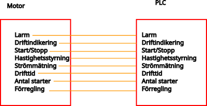
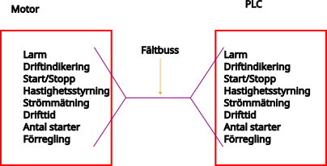
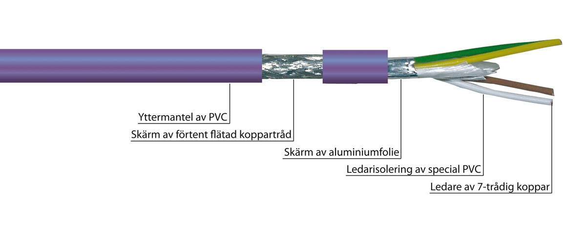
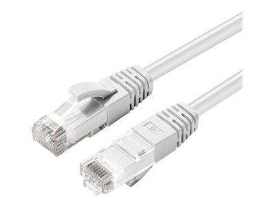
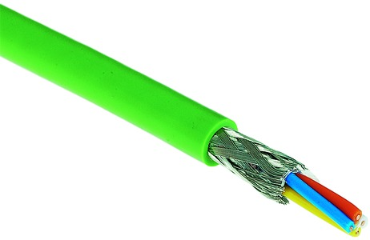
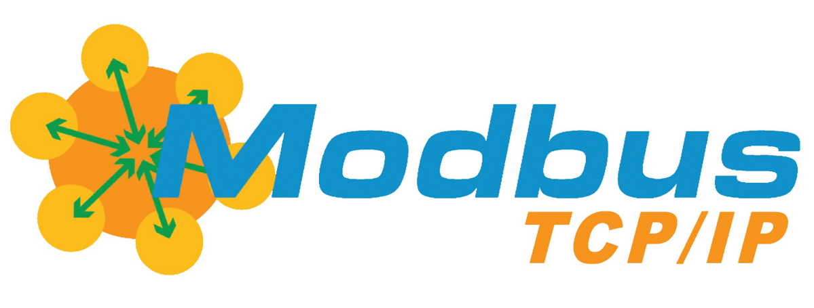
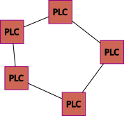

+++
title = "Fältbussar"
date = "2023-05-15"
author = "Alex"
authorTwitter = "" #do not include @
cover = ""
tags = ["Genomgång", "EE"]
keywords = ["", ""]
description = ""
showFullContent = false
draft= true
+++

# Fältbussar

Fältbussar är ett kommunikationsgränssnitt inom industriell automation för att ansluta enheter till ett nätverk för smart kommunikation.
De vanligaste fältbussarna är profibus, profinet, modbus och CAN-bus.

## Varför fältbussar
Inom elektriska installationer av industriell hårdvara där man kopplar in givare och motorer blir det mycket signaler som ska skickas fram och tillbaka. Tillexempel en motor ska ha dessa signaler:

1. Driftindikering
2. Larm
3. Start/Stopp
4. Hastighetsstyrning
5. Strömmätning
6. Drifttid
7. Antal starter
8. Förregling

Bara med dessa exempel är det 8 signaler, detta innebär att det behövs minst 8 sladdar + spänningsförsörjning för signalerna.

---

Här kan man istället använda en fältbuss för att få in signalerna via smart kommunikation så att man kan dra en kommunikationskabel istället för att få in signalerna. 

Det finns ännu en fördel med att köra fältbuss och det är att oftast finns det ett styrsystem som ska få in signalerna på io-kort. Allt detta slipper man om man kör fältbuss.

# Vad finns det för typer av fältbussar

## Seriell fältbuss
Den vanligaste och äldsta typen av fältbuss är av den seriella typen. Dessa fältbussar kör inte ethernet som våra datorer utan en äldre kommunikationstyp som heter RS-485 eller RS-232 beroende på hur snabb dataöverföring och längd på kabeln som behövs.
Fördelen med seriell fältbuss är att den är mycket enklare uppbyggd och det krävs mindre utrustning för att få igång kommunikation. Nackdelen är att när det blir fel på den seriella bussen är det inte lika lätt att felsöka och att hastigheten med seriell fältbuss är låg.

*Kontakt för seriell kommunikation*

### Profibus DP
Profibus DP är en fältbuss som är utvecklad av Siemens. Denna fältbuss är vanlig inom industrin och kännetecknas av lila kablar 

*Profibus DP kabel*

Profibus är en fältbuss som är styrd, det vill säga tillverkaren av hårdvara måste leverera GSD-filer till hårdvaran, till exempel en motor, för att kommunikationen skall fungera. I GSD filen finns allting som utrustningen behöver för att kommunicera med varandra. Detta gör att det är väldigt enkelt att få kommunikationen att hoppa igång, nackdelen är att det inte är alla tillverkare som väljer profibus utan väljer andra fältbussar.

Profibus DP är på väg bort från marknaden, Siemens har lanserat Profinet som är ledande fältbuss just nu. Profibus DP finns dock kvar på många äldre installationer. 

Hastigheten på Profibus är 12 000 kbit/s.

### Modbus RTU

\
*Logga modbus RTU*\
\
Modbus RTU är en fältbuss som från början är utvecklad av Modicon 1979. Till skillnad från Profibus är Modbus helt fri att konfigurera som man vill, inga GSD-filer krävs. Detta gör att fler tillverkare stöder Modbus än Profibus och det finns mer utrustning som stöder Modbus. Nackdelen med detta är att det kräver mycket jobb för att få igång kommunikationen för att systemen ska kunna prata med varandra. Ofta tillhandahålls en lång lista över adresser och signaler som finns att tillgå i utrustningen och sedan är det upp till integratören att välja och programmera styrsystemet för att läsa adresserna.

Modbus har även en variant som heter Modbus TCP som använder Ethernet/TCP istället för seriellt, båda varianterna används fortfarande.

### CAN-bus

\
*CAN-bus kabel*\
\
CAN-bus är en seriell bus som används inom bilindustrin. I alla moderna bilar så sitter det CAN-bus som de olika delarna i bilen använder för att prata med varandra. Det är också den bussen som bilverkstäder kopplar in sig på för att se felkoder i bilen.

## Fältbussar över ethernet

\
*Patch kabel*

Idag har det blivit populärare att köra fältbussar över ethernet kablar för att få upp hastigheten samt att fler känner igen sig med vanliga RJ45-kontakter. Att man kör fältbuss över ethernet betyder inte att man köra vanlig nätverkstrafik, eftersom de flesta fältbussar tar över hela OSI-modellen för att optimera trafiken för industriell kommunikation.

### Profinet

Profinet är efterträdaren till profibus. Det är också utvecklat av Siemens och funkar på liknande sätt som profibus. Den stora skillnaden är att det är liknande kablar som en CAT6-kabel, men det är viktigt att man köper de speciella Profinet kablar som finns på marknaden för optimal prestanda. Dessa kablar är gröna. 

*Profinet kabel*

Annan utrustning såsom switchar går att använda vanliga nätverksswitchar, men Siemens rekommenderar att man köper switchar som är utformade just för Profinet.
Profinet använder, lika som profinet, också .GSD-filer för att sätta upp kommunikation mellan olika enheter.

Profinet är efterträdaren till profibus och används uteslutande idag vid nyinstallation av fältbuss. Profibus används endast i undantagsfall eller där man redan har profibus installerat.

Profinet tar över OSI-modellen, och detta gör att man inte kan använda en profinet-slinga för att skicka vanlig TCP/IP trafik. Kör man Profinet går det bara att använda nätverket för Profinet trafik.

### Modbus TCP

\
*Logga modbus TCP*

Modbus TCP är egentligen samma som Modbus RTU med den skillnaden att man kör TCP/IP trafik istället för seriell trafik. 

Till skillnad mot Profinet tar modbus TCP inte över OSI modellen vilket gör att man kan använda samma nätverk för fältbussen som till exempel internet eller vanligt hemnätverk. Nackdelen med detta är att Modbus inte kommer upp i samma hastigheter eller tillförlitlighet som profinet, då modbus inte har kontroll över hela nätverket.

Samma problem och fördelar finns med Modbus TCP som Modbus RTU, tillverkare behöver inte göra några konfigurationsfiler utan ger istället ut listor på vilka signaler som integratören kan ta in i sina system.

## Topologi för fältbussar
Hur man sätter upp ett nätverk för fältbussar skiljer sig från hur man arbetar med ett hemnätverk eller företagsnätverk. I hemnätverk använder man ofta en stjärn-topologi, där alla enheter når varandra via en central punkt, oftast switch eller router med inbyggd switch.

*Stjärn-nätverk*

I ett fältbussystem används ofta en ring-topologi eftersom det oftast innebär mindre kabel för elektrikern att dra.

*Ring-nätverk*

Fördelarna med ett ring-nätverk är att det är oftast mindre kabel att dra, det går snabbare eftersom det inte ingår någon switch utan enheterna sköter kommunikationen själva och det går lättare att felsöka.
Nackdelarna är att om det blir fel på ringen så slutar oftast all kommunikation på hela slingan. Det är också svårt att lägga till enheter efter att fältbussen är färdig, då man måste bryta upp hela slingan för att lägga till enheter.

De olika fältbussarna har olika krav angående topologier, vilken topologi som används bestäms ofta efter val av fältbuss.

## Sammanfattning av fältbussar
Det finns många olika fältbussar med olika användningsområden, snabbhet, säkerhet och lättillgänglighet.
Det finns både fördelar och nackdelar:\
Fördelar:
- Fältbussar är ett kostnadseffektivt sätt att installera industriella komponenter till ett styrsystem (PLC)
- Det går att få ut mycket mer data av anläggningen än om man kör "hårdtrådat" till varje anläggningsdel.
- Kommunikationen går snabbare

Nackdelar:
- Nackdelen med fältbuss är att man blir väldigt fastlåst kring vilken utrustning man kan installera då det måste finnas stöd för fältbussen.
- Det är svårare att felsöka för en vanlig elektriker då man inte bara kan ta fram multimetern och mäta, utan mätdatan lever i bussen.
- Man blir mer beroende av att styrsystemet fungerar, det kan vara svårt att hålla igång anläggningen om styrsystemet inte fungerar om man kör via fältbuss.