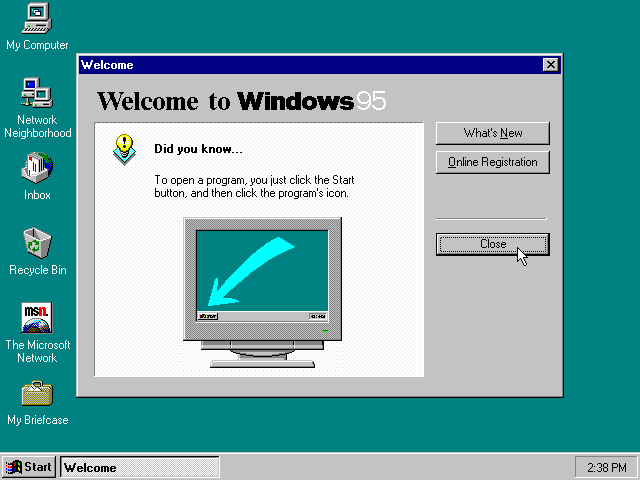
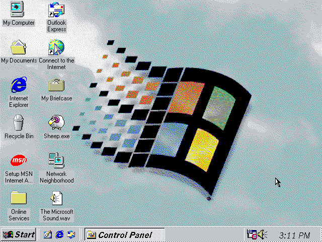
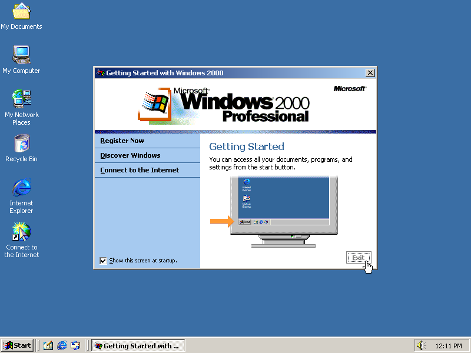
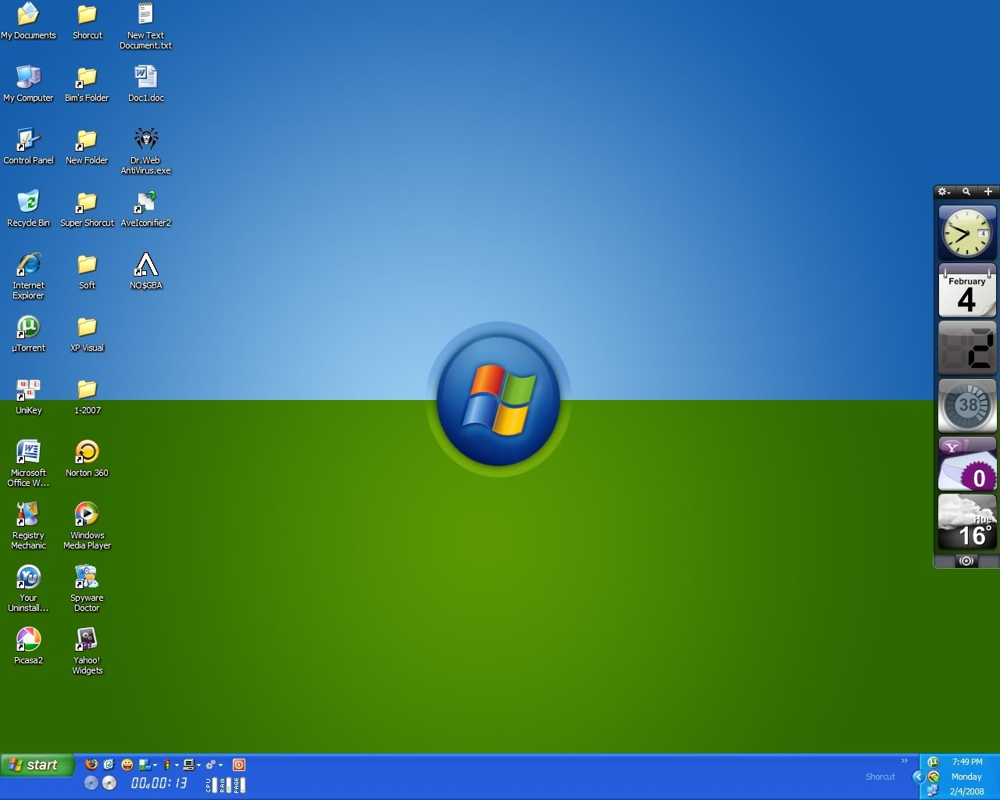
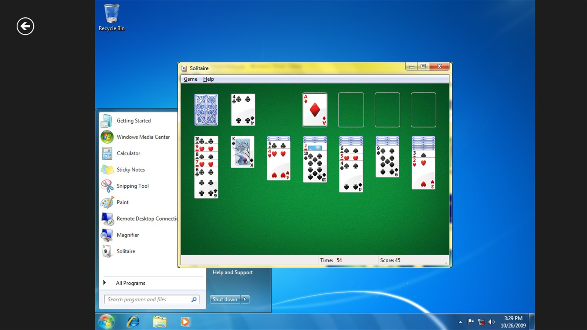
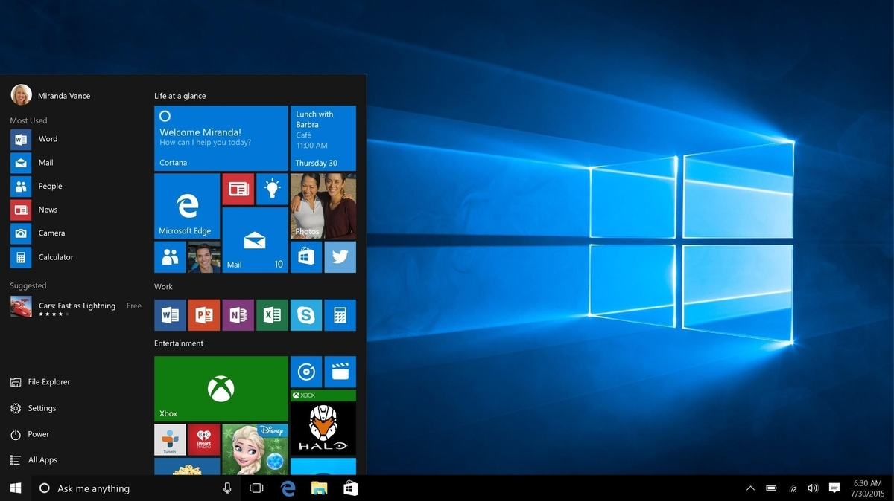
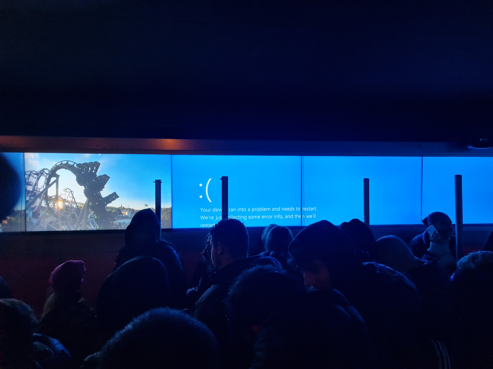

+++
title = "Instudering windows"
date = "2023-11-11T14:08:14+02:00"
author = ""
authorTwitter = "" #do not include @
cover = ""
tags = ["EE", "teknik", "instudering"]
keywords = ["", ""]
description = ""
showFullContent = false
readingTime = false
hideComments = false
color = "" #color from the theme settings
+++

# Windows

## Inledning

Windows är ett operativsystem utvecklat av Microsoft. Det är idag det största och vanligaste för persondatorer och inom professionella användare. Statistiken för vilket operativsystem som används för persondatorer från Maj 2023 syns nedan: 

| Windows | Linux | MacOS | ChromeOS |
| --- | --- | --- | --- |
| 62,06% | 2,7% | 18,96% | 3,59% |

Windows har blivit populärt beronde på en mängd fördelar, bland annat: 

 - Kompatabilitet  
 Windows fungerar med de flesta datorer och de har ett brett utbud av drivrutiner. De flesta program fungerar även på windows.
 - Användarvänlighet  
 Windows är intuitivt för användaren och de flesta behärskar systemet.
 - Marknadsdominans  
 Windows har haft en ledande ställning på operativsystemsmarknaden och följer ofta med när man köper en ny dator.
 - Stor programvarustöd  
 Windows fungerar med de flesta program, och många spel fungerar endast på windows
 - Företagsanvändning  
 Windows är dominerande på företagssidan på grund av support-avtal, som är viktigt för företagen.

Även om Windows är populärt så har det vissa nackdelar som:

 - Kostnad  
 Om man inte har en windows licens så är den rätt dyr att köpa. Uppemot 1000 kronor kan en windows 11 licens kosta (2023).
 - Installation av programvara  
 Ska man installera ett program så får man oftast ladda ner installationsfilen själv från en hemsida som man också får hitta själv. Detta är en säkerhetsrisk då man inte alltid kan lita på de hemsidor man hittar
 - Säkerhetsrisker  
 Windows är det populäraste operativsystemet för användare, på grund av det är det också attraktivt för hackare som vill angripa så många användare som möjligt.
 - Uppdateringar  
 Windows kräver regelbundna uppdateringar som i vissa fall kan störa användaren genom att kräva omstart av datorn.
 - Integritetsfrågor  
 Microsoft har i vissa fall kritiserats för att inkränkta på användarnas integritet i samband med datainsamling av användardata

---

## Historia

Började som MS-DOS, med Windows 3.11 kom fönster.

 - **MS-DOS (1980)**:
 Operativsystem för datorer utan grafiskt gränssnitt. Här kunde man endast skriva kommandon till en "terminal". Detta operativsystem låg som grund för de senare grafiska.
 - **Windows 3.0 (1990)**:
 Denna versionen populariserade användningen av windows grafiska gränssnitt för persondatorer
 
Skrivbord windows 3
 - **Windows 95 (1995)**:
 Start-knappen introducerades, aktiv skrivbordsmiljö aktiverades och Plug-and-Play hårdvaruinstallation

Skrivbord windows 95
 - **Windows 98 (1998)**: 
  Förbättrade kompatibilitet och prestanda, Internet explorer användes som standard-webbläsare.

Skrivbord windows 98
 - **Windows 2000 (2000)**:
 Windows 2000 var inriktat på företagsanvändare och erbjöd ökad stabilitet och säkerhet.

Skrivbord windows 2000
 - **Windows XP (2001)**: Windows XP var extremt populärt och kändes som en av de mest stabila och användarvänliga versionerna. Den användes under lång tid.

Skrivbord windows XP
 - **Windows Vista (2007)**: Vista hade en svår start med prestandaproblem och kompatibilitetsfrågor. Det anses vara en mindre framgångsrik version.

 - **Windows 7 (2009)**: Windows 7 återställde förtroendet för Windows med en förbättrad användarupplevelse och bättre prestanda.
 
 
Skrivbord windows 7

 - **Windows 8 (2012)**: Windows 8 introducerade en ny modern gränssnitt, men det mötte motstånd på grund av förändringar i användarupplevelsen.

 - **Windows 10 (2015)**: Windows 10 markerade en återgång till en mer traditionell användarupplevelse och erbjöd kontinuerliga uppdateringar istället för stora versionssprång.
     

Skrivbord windows 10

 - **Windows 11 (2021)**: Windows 11 är den senaste versionen och har infört en ny estetik och flera användarupplevelseförbättringar.
---

## Filsystem och hierarki

Hårddiska visas som \<bokstav>:\ till exempel

    c:\

c-disken är i regel "huvud"-disken, och finns alltid på en windows dator. c-disken kan man kalla för "roten" av trädstrukturen.  
Dessa mappar finns i regel efter en nyinstallation av Windows:

    c:\ -
        - Program Files - Installationsmapp för program
        - Program Files (x86) - Installationsmapp för program som körs i 32-bitar
        - Users - Mappar för användare
        - Windows - Systemfiler för windows-operativsystemet

### Program Files
Program Files är mappen där program man installerar hamnar. Det finns **"Program Files"** och **"Program Files (x86)"**. Skillnaden är att **"Program Files"** används för 64-bitars program och **"Program Files (x86)"** används för 32-bitars program. Det är inget krav att program ska läggas i dessa mappar, de kommer antagligen fungera ändå, men så här ska det fungera.

### Users
Alla användare som finns på datorn har en egen mapp under **"Users"**. Här finns mappar som **"Mina dokument"** där man kan lägga de dokument som man själv använder. Alla filer som man lägger i sin användarmapp skyddas från andra användare på datorn, det vill säga ingen annan än användaren kommer åt dokumenten eller filerna *(förutom administratören som kommer åt allt)*. Det är också i sin användarmapp man ska placera alla filer som man använder på datorn så man inte skitar ner rot-strukturen på hårddisken.

### Windows
Windows mappen är den viktigaste mappen i hela filsystemet, utan Windows mappen kan man inte köra operativsystemet. Här ligger allting som windows behöver för att fungera, och också vissa programbibliotek som andra program behöver för att fungera. Ska man gå in i denna mappen och ändra är det viktigt att man tänker till både en, två och tre gånger om det verkligen behövs, för gör man fel i denna mappen så kan det bli så att windows aldrig startar igen.

## Rättigheter

I windows finns det i regel två typer av användare

- Användare 
- Administratör

### Användare
En vanlig användare har en egen hem-mapp och kan köra installerade program på datorn. Annars finns det begränsningar kring vad användaren får göra. Dessa begränsningar bestäms av administratören. Exempel på olika begränsningar kan vara:

- Installation av program
- Inställningar i windows 
- Vilka mappar som kan användas
- Vilka program som får köras

Alla dessa inställningar kan ställas in av administratören för datorn, eller om man jobbar i en företagsmiljö så kan det ställas in med hjälp av olika policys som IT-avdelningen på företaget styr.

### Administratör

En admninistratör får göra **vad som helst** i operativsystemet. En administratör är chef och styr allting som får göras på datorn. En administratör får gå in i alla mappar på operativsystemet, inklusive mappar som tillhör andra användare. För en hackare är det administratörskontot som man vill åt, därför är det viktigt att skydda sitt administratörskonto på datorn med hjälp av ett starkt lösenord eller biometriska uppgifter som fingeravtryck eller kamerafunktion som Windows Hello.

## Serverversion

Microsoft har förutom operativsystemet windows också många andra produkter, en av produkterna som hör ihop med windows är Windows Server. Windows Server är ett operativsystem som man använder för servrar, alltså datorer som tillhandahåller information till andra datorer. 
Windows Server liknar vanliga Windows men har fler inbyggda funktionaliteter som till exempel Windows Active Directory som är väldigt populärt hos företag för att administrera användarkonton och nätverket.
Windows server

## Support
För att få support på operativsystemet Windows finns mycket hjälp att få via google eftersom det är så populärt operativsystem. Man får ofta svar på sin fråga på första sidan av sin google-sökning.   Microsoft har också mycket egna supportsidor på sin <a href="https://support.microsoft.com/sv-se/windows">hemsida</a>, där man kan få hjälp på de flesta av sina produkter och funktioner.

Hjälp inuti operativsystemet nås också via "F1"-knappen på tangentbordet, detta funkar i de flesta större program.

## Anpassning
I Windows finns många sätt att anpassa miljön så den blir mer personlig och lättare att använda. Exempel på anpassningar som går att göra:
 - Ändra skrivbordsbakgrund
 - Ändra tema
 - Ändra inställningar för mus och tangentbord
 - Anpassningar som underlättar för de med funktionshinder
 - Lägga till genvägar för applikationer som används ofta

## Applikationer
Många applikationer finns i Windows redan efter installation, några exempel på användbara applikationer:
- mspaint, ett simpelt ritprogram
- notepad, ett simpelt program för att redigera text
- cmd eller powershell, terminalprogram för att "komma under huven" på operativsystemet
- explorer eller utforskaren, ett program för att se vad som finns för filer i filsystemet
- Internet Explorer eller Edge, en webbläsare för att se webbsidor
- calc, en simpel kalkylator
- Snipping tool, Ett program för att ta skärmdumpar
- Windows Defender, antivirus och brandvägg
- Windows update, ett uppdateringsprogram för operativsystemet

## Powershell

I windows 8 introducerades Powershell, som är ett skriptingverktyg för microsoft produkter. För professionella användare kan powershell hjälpa till att automatisera mycket av arbetet med datorn. 

## Molntjänster

## Blåskärm

Om operativsystemet 

*Bild tagen vid kön till attraktionen "Monster" på gröna lund*